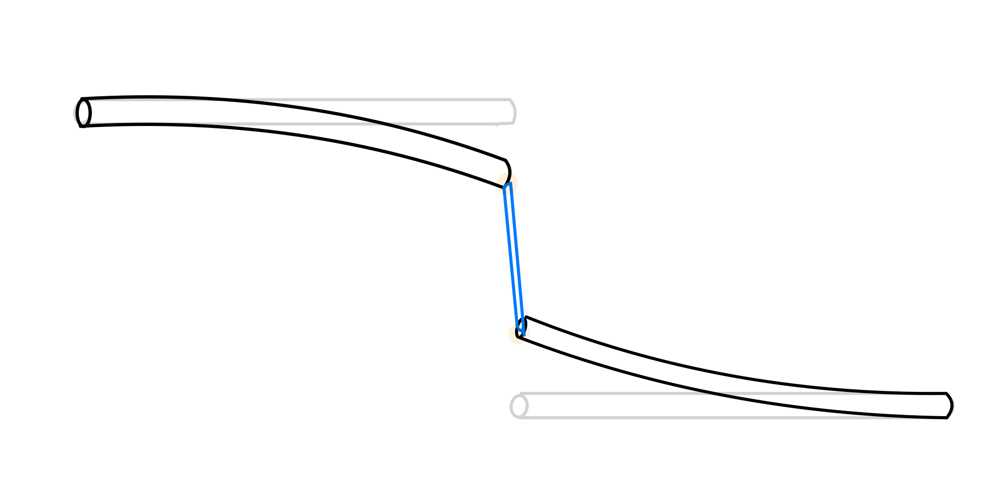

# ME700_FinalProject
## Simulation of Elastin Fiber Stretching  
### Tutorials
This code simulates the elastin fiber stretching process. I used pygmsh and gmsh to mesh the 3 columns, one is left glass optical fiber, connecting the elastin fiber from the top, another is elastin fiber, the other one is the right glass optical fiber, which is conecting to the bottom of the elastin fiber. See below schematic for the device set up.  

After meshing them, I imported the .xdml file to FENicsX for finite element analysis, including setting up the boundary condition, tying the three columns together, and applying both linear elasicity model and Neo-Hookean model.  
Finally, pyvista show the whole simulation process with a .gif file.


Let's start with setting up FENicsX environment
```bash
module load miniconda
conda create -n fenicsx-env
conda activate fenicsx-env
conda install -c conda-forge fenics-dolfinx mpich pyvista
pip install gmsh
pip install pygmsh
pip install h5py
```
To run the code
```bash
python simulation.py
```
See process.gif for the simulation result.  
The comparison between this simulation and the experimental data:  
Final tip displacement (simulation):
Left optical fiber tip: 1.50e-02 m  
Right optical fiber tip: 0.00e+00 m  
Elastin strain: 4066.66 % (Original length: 3.60e-04 m)  
Experimental data:  
Left optical fiber tip: 0.000922 m  
Right optical fiber tip: 0.000686 m  
Elastin strain: 3620.00 %  
elastin_curve.jpg is a experimental stress strain curve of a elastin fiber.  

### ME700 Applied Skills
**Technical Knowledge**  
* Implement finite element analysis techniques for solving complex mechanical problems  
* Analyze and solve problems involving material nonlinearity and geometric nonlinearity (large deformation in this project)  
**Software Development & Implementation**
* Use GitHub for code management  
* Python programming including implenting open sources code
**Integration & Application**
* Design and implement comprehensive solutions that integrate mechanical theory with practical software implementation
* Create modular, reusable code that follows software engineering best practices while solving mechanics problems
* Develop and execute verification and validation strategies for computational mechanics implementations  
